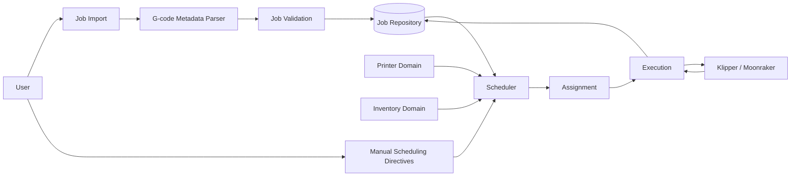
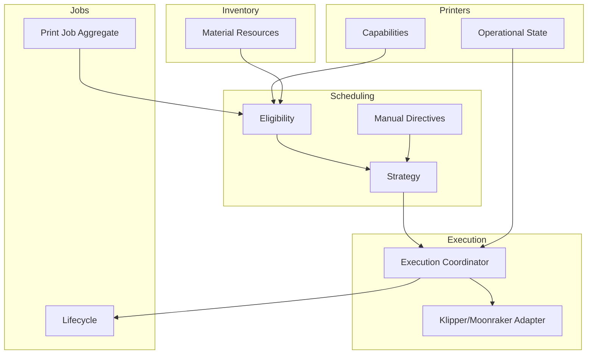

# Architecture Overview

## Purpose

Print Job Manager coordinates complete, ready-to-print jobs across compatible printers. Its central architectural concern is constraint-based scheduling rather than manual queue maintenance.

## High-Level Flow



## Components

### Job Import

Accepts one G-code file, stores the original artifact, invokes metadata extraction, and asks the user only for required values not present in the file.

It does not create a job until validation succeeds.

### G-code Metadata Parser

Detects known slicer or metadata formats and extracts normalized planning values. It does not interpret full toolpaths or modify the G-code.

Parser output should retain provenance such as detected format, source key, and parser version where useful for diagnostics.

### Job Repository

Stores the durable job aggregate:

- immutable execution definition
- mutable scheduling data
- lifecycle state and transition history
- optional lineage to a duplicated or replacement job

Active queue and history screens are projections of this repository.

### Printer Domain

Owns printer identity, capabilities, availability, and operational state. It reports facts to scheduling and execution but does not choose its next job.

### Inventory Domain

Owns available material resources. Jobs state material attributes and estimated usage, not a permanent reference to one specific spool.

Inventory availability is checked as part of eligibility, and a concrete material resource is reserved when the scheduler creates an assignment.

### Scheduler

The scheduler is the sole authority for selecting the next job.

Its conceptual pipeline is:

```text
Global active-job pool
        |
        v
Apply manual directives
        |
        v
Filter by hard requirements
        |
        v
Rank eligible candidates using preferences and strategy
        |
        v
Create assignment
```

The scheduler should keep eligibility rules separate from ranking rules so both can be tested and explained independently.

### Assignment

An explicit decision that a particular job should execute on a particular printer. Assignment is distinct from the job’s printer preference or requirement.

The exact lifecycle and persistence model for assignments remains to be specified.

### Execution

Hands the canonical G-code artifact to the printer integration, observes execution events, and requests valid lifecycle transitions.

Execution reports failures but does not automatically decide to retry them.

### Klipper / Moonraker Integration

Acts as an infrastructure adapter. Domain logic should not depend directly on transport details, Moonraker payloads, or Klipper-specific event formats.

## Architectural Boundaries



## Data Ownership

| Data | Owner |
|---|---|
| G-code and extracted metadata | Jobs |
| Required user-supplied job values | Jobs |
| Job priority and due date | Jobs |
| Manual scheduling directives | Scheduling |
| Printer capabilities and state | Printers |
| Material-resource state | Inventory |
| Eligibility result | Scheduling |
| Assignment decision | Scheduling |
| Printer execution events | Execution |
| Durable job lifecycle | Jobs, through controlled transitions |

## Key Invariants

- One job refers to one canonical G-code file.
- A job cannot be created with missing required planning data.
- Extracted metadata is authoritative when present.
- Hard requirements must be satisfied before ranking begins.
- A required printer assignment cannot be overridden by optimization.
- A preferred printer may be overridden by the scheduler.
- A failed job cannot automatically return to scheduling.
- Execution data cannot be changed after queueing.
- Terminal jobs remain part of history.

## Extensibility

The architecture should allow additional:

- metadata extractors
- printer capability types
- compatibility rules
- scheduling strategies
- execution adapters
- inventory policies

These extensions should plug into stable domain interfaces rather than enlarge the `PrintJob` entity with integration-specific behavior.

## Open Architectural Work

- define aggregate and transaction boundaries
- define lifecycle transition authority and idempotency
- define assignment persistence and cancellation behavior
- define default scheduling algorithm
- define compatibility rule model
- define integration error handling and reconciliation
- define event, polling, or hybrid update model for printer state
